<picture>
  <source media="(prefers-color-scheme: dark)" srcset="assets/hero-dark.svg">
  
</picture>

<h1 align="center">DeckTalk</h1>

<p align="center"><b>Narrated presentations, cut to the word.</b><br>
Write a script. Your cloned voice reads it. Every visual lands on the word that introduces it.</p>

<p align="center">
<a href="https://pypi.org/project/decktalk/"></a>
<a href="https://github.com/jacobcbeaudin/decktalk/actions/workflows/ci.yml"></a>
<a href="https://www.python.org/"></a>
<a href="LICENSE"></a>
</p>

<br>

```console
$ uv tool install decktalk && decktalk setup
$ decktalk init my-lesson && cd my-lesson
$ decktalk build
```

That is a finished video: `build/out/my-lesson.mp4`. Add `--silent` to build without an
API key; the scaffold is a working three-scene deck.

## Why

Recording a narrated deck means keeping three things in sync: what you say, what is on
screen, and when. Every tool makes you scrub a timeline to line them up, and every edit
to the script breaks the alignment again.

DeckTalk removes the timeline. The narration comes back with a timestamp for every word,
so a slide reveal is cued to a phrase, not a second. Change a sentence and only that
section re-renders. The script is the edit.

It started as the pipeline behind a six-minute hackathon film that had to be re-cut nine
times in a day. This is that pipeline, made general.

## How it works

<picture>
  <source media="(prefers-color-scheme: dark)" srcset="assets/how-it-works-dark.svg">
  
</picture>

A cue names a phrase:

```json
{ "step": "3.1eq", "on": "the equation" }
```

and a slide names its cue:

```html
<div data-cue="3.1eq" data-tex="\frac{d}{dx}\,x^2 = 2x">d/dx x² = 2x</div>
```

Slides are plain HTML you style yourself. One small runtime file gives them the
contract; open the page in a browser to review it, freeze any step, or screenshot every
step for a reviewer.

## What you get

- **Frame-exact cuts.** The recorder marks narration t=0 in every recording; the cut is measured, not guessed.
- **Cached narration.** Sections are hashed by text. Edits re-synthesize only what changed.
- **A soundscape.** Optional underscore ducked under speech, ambience beds, one-shot effects on cues, broadcast loudness.
- **Offline drafts.** `--silent` renders the whole film with placeholder narration and estimated word times.
- **Checks, not hope.** Black or truncated recordings are caught before assembly; `verify` proves each cue moved pixels.
- **Nothing to install by hand.** Chromium and ffmpeg come through Python packages. `decktalk setup` fetches both.

## Learn more

- [The project file](docs/project-file.md): sections, voice, transitions, mix, tuning.
- [The page contract](docs/contract.md): how a slide talks to the recorder.
- [Python API](docs/contract.md#build-artifacts-a-page-or-script-may-read): `decktalk.Project`, one function per stage, typed results.

## Costs

Narration is ElevenLabs, billed per character with word timestamps: a six-minute script
is about 6,000 credits per take, and edits re-bill only the sections that changed. A
Creator plan covers a day of iteration.

## Development

```console
$ uv sync --group dev
$ uv run ruff check src tests && uv run ty check src && uv run pytest -q
$ uv run pytest -q -m browser       # the runtime, in a real Chromium
$ bash tests/smoke.sh               # scaffold and build a project offline
```

MIT.
