<picture>
  <source media="(prefers-color-scheme: dark)" srcset="assets/banner-dark.svg">
  
</picture>

<div align="center">

# DeckTalk

**Narrated presentations, cut to the word.**

[](https://pypi.org/project/decktalk/)
[](https://www.python.org/)
[](https://docs.astral.sh/uv/)
[](https://docs.astral.sh/ruff/)
[](https://github.com/astral-sh/ty)
[](https://elevenlabs.io/)
[](https://playwright.dev/python/)
[](https://ffmpeg.org/)
[](https://github.com/jacobcbeaudin/decktalk/actions/workflows/ci.yml)

*A script in markdown. Your cloned voice reads it and returns a timestamp for every
word. Your slides are plain HTML, and each reveal names the spoken phrase it lands
on. DeckTalk records, cuts, mixes, and publishes one mp4.*

**Change a sentence and only that section re-renders.**

</div>

---

A narrated deck has three parts that keep drifting apart: what you say, what is on
screen, and when. DeckTalk pins them together with word timestamps. You never scrub a
timeline. The script is the timeline.

## Quick start

```console
$ uv tool install decktalk         # or: pipx install decktalk
$ decktalk setup                   # fetches headless Chromium and ffmpeg, once per machine
$ decktalk init my-lesson && cd my-lesson
$ decktalk build --silent          # a full render with placeholder narration, no key needed
$ open build/out/my-lesson.mp4
```

Then add your ElevenLabs key and voice to `.env` and run `decktalk build` for the real
thing. The scaffold is a working three-scene deck: run it as-is first, then edit.

## How it works

```
 script.md ──────► narrate ──► NN-slug.mp3 + word timestamps ──► narration.mp3 + timeline.json
                                                                        │
 cues.json ──────► beats ───► "cue 3.1eq lands at 5.80 s" ◄─────────────┘
                                   │
 deck/index.html ► record ──► Chromium plays each scene driven by ?beats=…, flashes a
   (+ runtime)                marker at narration t=0 ──► NN-scene.webm
                                   │
                   measure ─► finds the marker, so video t=0 == audio t=0 to the frame
                   assemble ► cuts every section to its span, concatenates, lays the
                              narration under the picture, ducks the underscore, normalizes
                   verify ──► every section opens on a real frame; every cue moves pixels
```

| Principle | What it means in practice |
| --- | --- |
| **The script is the timeline** | Sections in the script are the cut points. Cues name spoken phrases, not seconds. Rewrite a line and the affected section re-narrates, re-records, and re-cuts; everything else is cached by text hash. |
| **Pages, not a slide format** | A scene is an HTML file you style however you like. `decktalk-runtime.js` adds the contract: `data-cue="3.1eq"` reveals on that cue, `data-count` counts a number up, `data-tex` typesets with KaTeX. Open the page in a browser to review; `?step=ID` freezes any step. |
| **Frame-exact, by measurement** | Chromium's recorder has a variable start-up latency. The recorder flashes the frame magenta exactly when the narration clock starts, and the assembler trims to that frame. No guessing, no drift. |
| **Offline first** | `--silent` renders the whole film with placeholder narration and estimated word times, so layout passes cost nothing. The real voice is the last thing you add. |
| **Nothing to install by hand** | Chromium comes through Playwright's Python package, ffmpeg through `static-ffmpeg`. `decktalk setup` fetches both; `decktalk doctor` confirms them. |
| **Checks, not hope** | `check` catches a black or truncated recording before assembly. `verify` proves every section opens on a real frame and that the picture changes where each cue says it should. `shots` gives you a PNG per step to look at, or to hand to a reviewer. |

## A project

```
my-lesson/
  decktalk.toml      the plan: one [[section]] per script section → a page+scene, or your own clip;
                     voice, transitions, mix, soundscape prompts, optional tuning
  script.md          the narration; "## N. Title" sections, [bracketed directions] unspoken
  cues.json          for each visual, the spoken phrase it lands on
  deck/index.html    your slides, with decktalk-runtime.js
  media/             your clips and the underscore markers
  build/             everything generated (git-ignored)
```

A cue in `cues.json`:

```json
{ "sections": { "3": { "cues": [
  { "step": "3.1",     "on": "$start" },
  { "step": "3.1draw", "on": "curve draws" },
  { "step": "3.1eq",   "on": "equation", "offset": 0.2 }
]}}}
```

The step it drives, in `deck/index.html`:

```html
<script src="decktalk-runtime.js"></script>
<script>
DeckTalk.scene(3, { name: "A curve and an equation", camera: "push", steps: [
  { id: "3.1", hold: 10, render: () => `
      <svg …><path class="curve" pathLength="1" data-cue="3.1draw" data-fx="draw" data-dur="3" d="…"/></svg>
      <div class="eq" data-cue="3.1eq" data-tex="\\frac{d}{dx}\\,x^2 = 2x">d/dx x^2 = 2x</div>` },
]});
</script>
```

Write numbers and symbols in the script the way you want them said: the cue matches the
spoken words "two x", and the card shows the symbols. Full references:
[decktalk.toml](docs/project-file.md) and [the page contract](docs/contract.md).

## Commands

| Command | Does |
| --- | --- |
| `decktalk init DIR` | Scaffold a project with a working example deck. |
| `decktalk setup` / `doctor` | Fetch Chromium and ffmpeg / report what is installed. |
| `decktalk narrate [--dry-run] [--silent] [--only N]` | Script to per-section audio with word timestamps, plus the continuous track and timeline. |
| `decktalk beats` | Resolve every cue phrase to a second. Reports any phrase it cannot find. |
| `decktalk soundscape [--dry-run]` | Ambience, one-shot sfx and an underscore from prompts in `decktalk.toml`. |
| `decktalk record` / `measure` / `check` | Record the pages; find narration t=0 in each; flag black or truncated recordings. |
| `decktalk assemble [--preset veryfast] [--nomix]` | Cut, concatenate, mix, normalize, publish. |
| `decktalk verify [SEC:CUE …]` | Section starts, and cue landings by the share of pixels that change inside the section. |
| `decktalk shots [--section N --at S …]` | One PNG per step, or frames from a section as it plays with its real cues. |
| `decktalk build [--silent] [--only N]` | The whole pipeline in order. |
| `decktalk status` | The timeline and what is built. |

Every project command takes `--project DIR` and reads `.env` from the project. Keys are
never printed. `-v` shows every ffmpeg command line.

## Configuration

Three layers, lowest to highest precedence: defaults in `decktalk.config`, tables of the
same names in the project's `decktalk.toml` (`[video] preset = "veryfast"`), and
`DECKTALK_<SECTION>_<FIELD>` environment variables. A few CLI flags such as `--preset`
override for one run. Per-presentation content (sections, voice, mix levels, prompts)
lives in the same file as the document rather than tuning; secrets live only in `.env`.

## Python API

```python
import decktalk

project = decktalk.Project.load("my-lesson")     # validated decktalk.toml + settings
project.settings.video.preset = "veryfast"
result = decktalk.build(project, silent=True)     # or narrate(), resolve_beats(), record(), …
print(result.assembly.final, result.verification.ok)
```

Stage functions return typed results and raise `decktalk.DeckTalkError` subclasses
instead of exiting; progress goes to the `decktalk` logger. `decktalk.media`,
`decktalk.providers` and underscore-prefixed names are internal. Until 1.0 the Python
names may move; the file formats, build artifacts and the page contract are stable.

## Costs

Narration is billed per character with word timestamps: a six-minute script is about
6,000 ElevenLabs credits per full take, and edits re-synthesize only the sections whose
text changed. Sound effects bill per second, music per minute. A Creator plan covers a day
of iteration.

## Development

```console
$ uv sync --group dev
$ uv run ruff check src tests && uv run ruff format --check src tests && uv run ty check src
$ uv run pytest -q                 # unit tests
$ uv run pytest -q -m browser      # the runtime contract, in a real Chromium
$ bash tests/smoke.sh              # scaffold a project and build it offline, about a minute
```

CI runs the checks on Linux, and the browser tests plus the offline build on Linux,
macOS and Windows. Releases are cut by tag: bump the version, `git tag v0.1.0`, push,
and the release workflow publishes to PyPI through trusted publishing.

## License

MIT.
