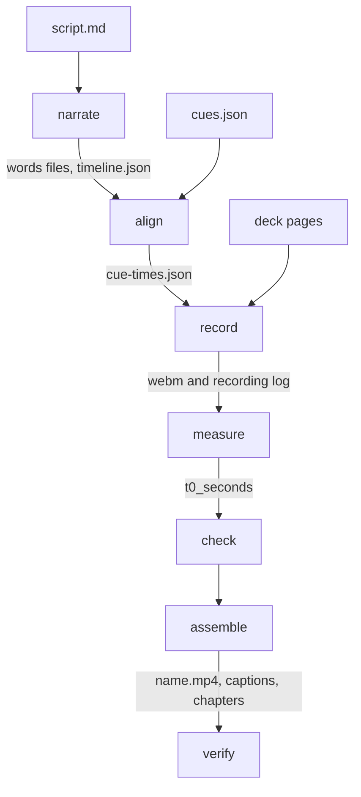

`decktalk build` turns your script and pages into one mp4 in seven stages. To build your first video, follow the
[Quickstart](/quickstart).

<Frame caption="Each panel names the pipeline stages it runs, in order.">
  <picture className="block dark:hidden">
    <source media="(max-width: 640px)" srcSet="/images/how-it-works-light-stacked.svg" />
    
  </picture>
  <picture className="hidden dark:block">
    <source media="(max-width: 640px)" srcSet="/images/how-it-works-dark-stacked.svg" />
    
  </picture>
</Frame>

1. You write four files: `script.md`, `decktalk.toml`, `cues.json`, and the page.
2. The speech provider voices the script and returns a start and an end time for every word.
3. Headless Chromium records each page section, and each reveal fires at its cue time.
4. ffmpeg cuts each recording to its section and joins the sections into one mp4.
5. `verify` measures the final mp4, so an early or late reveal shows as a number.

## Stages

The seven stages always run in this order. Each stage reads files that the stages before it wrote.



| Stage | One job | Writes |
|---|---|---|
| `narrate` | `narrate` voices each section and gets a time for every word. | `build/narration/NN-slug.mp3`, `NN-slug.words.json`, `takes.json`, `narration.mp3`, `timeline.json` |
| `align` | `align` turns each cue phrase into a cue time. | `build/cue-times.json` |
| `record` | `record` records each page section in headless Chromium. | `build/recordings/NN.webm`, `recordings/NN.json` |
| `measure` | `measure` finds narration t=0 in each recording. | `t0_seconds` in each recording log |
| `check` | `check` flags a recording that is black, short, stalled, or uncovered. | nothing |
| `assemble` | `assemble` cuts, joins, and mixes the sections into one mp4. | `build/sections/NN.mp4`, `<name>.mp4`, captions, chapters |
| `verify` | `verify` checks section starts, cuts, and cut continuity in the final mp4. | nothing |

Each stage is also a command with the same name, and [the CLI reference](/reference/cli) lists them.
[Build artifacts](/reference/artifacts) gives the fields of every file. `assemble` also runs the
[loudness pass](/concepts/sound#loudness).

## Why the cuts are exact

Each reveal starts on its word because DeckTalk finds narration t=0 inside every recording, to the frame.

<Frame caption="The bowl and the ball each appear whole in the first frame after their words.">
  
  
</Frame>

| Risk | What DeckTalk does |
|---|---|
| A browser starts to record at an unknown moment. Chromium on Windows starts later than on Linux. | The recorder covers the page in magenta. `measure` takes the first frame after the cover as narration t=0. |
| Chromium sends a frame only when the page paints. | The cover holds an element that always moves, so frames keep coming while the page is covered. |
| t=0 is known only to the nearest frame. | The video runs at 25 fps, the rate that Chromium records at. t=0 is exact to one frame, 40 ms. |
| Section lengths add up to fractions of a frame. | `assemble` rounds each section span to whole frames counted from the start of the narration. |
| A recording can end before its section span. | `assemble` repeats the last frame to fill the span. `hold_seconds` uses the same repeat. |
| Joined audio adds a short delay at each join. | Each `sections/NN.mp4` has no audio. `assemble` mixes the sound once, from zero. |

The recorder removes the cover only when the page is ready. [The handshake](/concepts/page-contract#the-handshake)
shows each wait. `measure` looks for the cover only in the first `[record] cover_scan_seconds` of each recording, 4 s by
default. The alignment never depends on wall-clock time.

## The build without voice

A build without voice replaces the voice with a click track, so it needs no account and no API key.

{/* sample: decktalk build --no-voice, build without voice of the scaffold, first narrate lines */}
```text
[sil ] 01-open.mp3  29 words -> 17.83s (estimated words)
[sil ] 02-how-it-works.mp3  40 words -> 20.83s (estimated words)
[sil ] 03-how-ai-learns.mp3  285 words -> 142.54s (estimated words)
```

- The click track has a soft click at the start of every estimated word, at -24 dBFS.
- `narrate` spaces the estimated words evenly at `silent_words_per_minute`, 150 by default. It adds each pause,
  beat, and tail. [script.md](/reference/script-md) gives the length rule.
- Every other stage runs as usual. A build without voice therefore tests the cues, the pages, the recording, the cut, and
  the checks.
- The `narrate` and `align` tables mark their times as estimated.
- The clicks let `verify` compare the picture with the sound in the final mp4. [Verify](/reference/verify#cues)
  explains the check.
- A build without voice skips the loudness pass, so the clicks keep their level.

A build without voice stops when the project has voiced takes, because it would empty the narration cache.
[A build without voice and a voiced build](/guides/rebuild-one-section#a-build-without-voice-and-a-voiced-build) explains the cost.

## Clips and the narration

A clip section plays a video with its own audio. `narrate`, `record`, and `measure` skip it, and the narration
pauses for a clip between two page sections.

<Frame caption="The narration pauses for each clip and resumes with the next page section.">
  
  
</Frame>

[Add a clip section](/guides/clip-section) shows how to place a clip and how the narration splits.

## Caching

`narrate` keeps each section's audio and a hash of its text in `build/narration/takes.json`. After an edit,
`decktalk build` voices again only the sections whose text changed. A plain build still records every page
section, and `decktalk build --only N` records only section N. A recording stays valid when a neighbor section
changes length, because cue times count from the start of their own section.
[Rebuild one section](/guides/rebuild-one-section) says what each edit runs again.

## What verify checks

`verify` checks the final mp4 in three ways.

- **Section starts:** the frame 0.2 s after each section start has a pixel brighter than luma 60.
- **Cuts:** the narration is at or below -40 dBFS in the last 0.15 s before each cut.
- **Cues:** the picture changes within 80 ms of each cue time. After a build without voice, it also changes within 120 ms
  of the click plus the offset key.

The verify stage inside `decktalk build` checks section starts and cuts, and cut continuity for a section that sets `seamless`. `decktalk verify` also checks the cues.
[Verify](/reference/verify) defines every measurement, limit, and result.

## Terms

| Term | Meaning |
|---|---|
| [Stage](/reference/glossary) | One of `narrate`, `align`, `record`, `measure`, `check`, `assemble`, and `verify`, in that order. |
| [Build without voice](/reference/glossary) | A build with `--no-voice`. It uses estimated word times and writes a click track. |
| [Voiced build](/reference/glossary) | A build without `--no-voice`. The speech provider voices the script. |
| [Click track](/reference/glossary) | The audio of a build without voice, with a soft click at every estimated word start. |
| [Narration t=0](/reference/glossary) | The first frame after the magenta cover, where the page clock starts. |
| [Recording](/reference/glossary) | The webm that `record` writes for a page section. |
| [Cut](/reference/glossary) | The boundary between two sections in the final video. |

## Next

- **Build your first video:** [Quickstart](/quickstart)
- **Rebuild after an edit:** [Rebuild one section](/guides/rebuild-one-section)
- **Read a verify table:** [Verify](/reference/verify)
