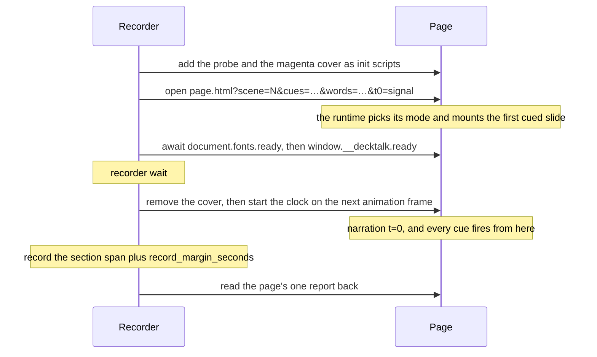

The page contract is the whole vocabulary a deck page may write. An element on a slide has four
moments, and each of them is the local name of a cue. Everything else is either how a moment looks,
which is a closed word the contract owns, or what a moment means, which is a sentence for the
transcript. Seconds are never written on the page, because `cues.json` owns them.

1. `decktalk-runtime.js` implements the contract, and a page that would rather
   [follow it by hand](/guides/page-by-hand) can.
2. A scene is markup: a `[data-scene]` wrapper holding one `<template data-slide>` per slide.
   Attributes do the work, so a page needs no JavaScript of its own.
3. The runtime adds only the stage element, the slide transitions and the reveal effects. Every rule
   of its own sits inside `:where()`, so one rule of yours wins.
4. To write your first page, follow [Your first deck](/guides/first-deck).

## The four moments

An element declares up to four moments, and each attribute's value is the local name of a cue rather
than a number.

| Moment | What happens | How long it plays |
|---|---|---|
| `data-in` | The element arrives. | The entrance `data-in-style` names, or the length `data-in-seconds` gives it. |
| `data-back` | The element steps back, dimmed to 45 percent and still readable. | 0.28 seconds. |
| `data-front` | The element returns to full strength. | 0.2 seconds. |
| `data-out` | The element leaves. | The exit `data-out-style` names, which is 0.2 seconds either way. |

They play in that order: in, back, front, out. An exit declared at or before its own entrance never
plays, which is [`PAGE_MOMENT_ORDER`](/reference/findings/PAGE_MOMENT_ORDER), and the order is read
off the cues the slide declares rather than guessed.

`data-back` and `data-front` are attention rather than reveal. Use them when one thing on the slide
has to recede while another is read, so the page never has to remove something and bring it back.

## The wire id

The runtime qualifies a local name into a wire id, which is the slide id, a colon and the local
name. So `data-in="expand"` inside `<template data-slide="4.1">` is the wire id `4.1:expand`, and
`4.1:expand` is what `cues.json` carries.

```html deck/index.html
<div data-scene="4" data-name="The listing">
  <template data-slide="4.1" data-describe="how often value is still listed">
    <p data-in="expand" data-describe="the hourly figure">by hour, through first pitch</p>
  </template>
</div>
```

That split is the contract's whole shape. The page owns what a thing looks like and what it means,
and `cues.json` owns the second it happens on. An author writing a slide never types a number of
seconds, and an author writing `cues.json` never types a class or an effect.

## The subjects

Every attribute is written on one of four subjects, and the table below names the subjects each row
admits.

| Subject | What it is |
|---|---|
| element | Anything inside a slide that declares a moment, a description or an effect. |
| container | An element whose children are the thing that arrives, which is what `data-stagger` and `data-steps` are written on. |
| scene | The `[data-scene]` wrapper a section names, which holds the slides. |
| slide | One `<template data-slide>` of a scene, which is what mounts. |

## Every attribute

This is the whole contract. `Value` gives the closed word set where a row has one, and otherwise says
what kind of value the row takes. A row that publishes a default may be written bare to take it, so
`data-words` alone is `data-words="highlight"`. `Range` is the range the row admits, in seconds, and
a value outside it or off its step earns [`PAGE_BAD_VALUE`](/reference/findings/PAGE_BAD_VALUE).
`Span` is the seconds of motion the row puts between its own cue and the next one, where `0` is a row
that never moves a pixel and `from the page` is a span read off the page or off a closed word set.

| Attribute | Subject | Value | Default | Range | Span | Code | Meaning |
|---|---|---|---|---|---|---|---|
| `data-in` | element, container | a local cue name |  |  | from the page | [`PAGE_MOMENT_UNKNOWN`](/reference/findings/PAGE_MOMENT_UNKNOWN) | The element arrives at this cue. |
| `data-describe` | element, slide | a phrase |  |  | 0 | none | The subject of the reveal, which the runtime gives a verb per moment. An empty phrase means decorative. |
| `data-tex` | element | TeX source |  |  | 0 | [`PAGE_KATEX_ERROR`](/reference/findings/PAGE_KATEX_ERROR) | Typeset with KaTeX, with the element's own text as the readable fallback. |
| `data-tex-display` | element | written bare |  |  | 0 | [`PAGE_KATEX_ERROR`](/reference/findings/PAGE_KATEX_ERROR) | Typeset the TeX as a display equation on its own line rather than inline. |
| `data-in-style` | element, container | `rise`, `settle`, `fade`, `pop`, `draw`, `cut` | `rise` |  | from the page | [`PAGE_BAD_VALUE`](/reference/findings/PAGE_BAD_VALUE) | How the element arrives. Each word declares its own span. |
| `data-back` | element, container | a local cue name |  |  | 0.28 | [`PAGE_MOMENT_UNKNOWN`](/reference/findings/PAGE_MOMENT_UNKNOWN) | The element steps back at this cue, dimmed but still readable. |
| `data-front` | element, container | a local cue name |  |  | 0.2 | [`PAGE_MOMENT_UNKNOWN`](/reference/findings/PAGE_MOMENT_UNKNOWN) | The element returns to full strength at this cue. |
| `data-out` | element, container | a local cue name |  |  | from the page | [`PAGE_MOMENT_ORDER`](/reference/findings/PAGE_MOMENT_ORDER) | The element leaves at this cue. |
| `data-words` | element | `highlight`, `appear` | `highlight` |  | 0.12 | [`PAGE_WORDS_NOT_FOUND`](/reference/findings/PAGE_WORDS_NOT_FOUND) | The line is shown word by word on the voice, matched against the section's spoken words. |
| `data-count` | element | `last`, `first` |  |  | 0.48 | [`PAGE_BAD_VALUE`](/reference/findings/PAGE_BAD_VALUE) | A number in the text counts up from zero when the element arrives. |
| `data-class` | element, container | moment:value pairs |  |  | from the page | [`PAGE_CLASS_UNDESCRIBED`](/reference/findings/PAGE_CLASS_UNDESCRIBED) | Adds a class at a moment, written as moment:name pairs, for the page's own stylesheet. |
| `data-describe-class` | element, container | moment:value pairs |  |  | 0 | none | What each class change means, as moment:phrase pairs separated by a vertical bar. |
| `data-stagger` | container | seconds |  | 0.04 to 0.2 in steps of 0.04 | from the page | [`PAGE_STAGGER_OVERRUN`](/reference/findings/PAGE_STAGGER_OVERRUN) | The container's children arrive this far apart from one cue. |
| `data-steps` | container | written bare |  |  | from the page | [`PAGE_STAGGER_EMPTY`](/reference/findings/PAGE_STAGGER_EMPTY) | Each cued child comes to the front as it arrives and the ones before it step back. |
| `data-in-seconds` | element, container | seconds |  | 0.12 to 0.48 in steps of 0.04 | from the page | [`PAGE_BAD_VALUE`](/reference/findings/PAGE_BAD_VALUE) | How long the entrance plays, which governs the entrance alone and never the onset. |
| `data-out-style` | element, container | `fade`, `fall` | `fade` |  | 0.2 | [`PAGE_BAD_VALUE`](/reference/findings/PAGE_BAD_VALUE) | How the element leaves. |
| `data-swaps` | element | written bare |  |  | from the page | [`PAGE_SWAP_AMBIGUOUS`](/reference/findings/PAGE_SWAP_AMBIGUOUS) | The element takes the place of whatever leaves on its own arrival cue, in a held swap. |
| `data-describe-out` | element | a phrase |  |  | 0 | none | Overrides the departure sentence when leaving means something of its own. |
| `data-scene` | scene | an id |  |  | 0 | [`PAGE_SCENE_EMPTY`](/reference/findings/PAGE_SCENE_EMPTY) | Declares the scene a section names, on the wrapper that holds its slides. |
| `data-name` | scene | a phrase |  |  | 0 | none | The scene's name in the index and in the catalog. |
| `data-slide` | slide | an id |  |  | 0 | [`PAGE_SLIDE_NO_ID`](/reference/findings/PAGE_SLIDE_NO_ID) | Declares a slide on a template. Its id qualifies every moment written inside it. |
| `data-hold` | slide | seconds | `8` | 1 to 60 in steps of 1 | 0 | none | How long the preview rests on this slide. No recording reads it. |
| `data-owns` | slide | local names |  |  | 0 | [`PAGE_CUE_UNKNOWN`](/reference/findings/PAGE_CUE_UNKNOWN) | Local names of cues only a handler serves, which no moment attribute mentions. |
| `data-enter` | slide | `crossfade`, `cut` | `crossfade` |  | 0.24 | [`PAGE_BAD_VALUE`](/reference/findings/PAGE_BAD_VALUE) | How this slide replaces the one before it. |

A `data-` attribute that is not in this table is
[`PAGE_UNKNOWN_ATTR`](/reference/findings/PAGE_UNKNOWN_ATTR), reported before a single pixel is
drawn, so a misspelling is a finding rather than an attribute nothing reads.

`decktalk schema page` prints this same table as JSON, with each row's `on`, `kind`, `values`,
`default`, `range`, `code`, `span`, `affects` and `summary`, and beside it the entrance, exit, word,
count, attention and slide word sets with their lengths, `measurable_span_seconds` and `capture_fps`.
The table above and the schema are written from one registry, so the page cannot say something the
registry does not.

```console
decktalk schema page
```

## The five rows that earn no code

An attribute lives in the contract only when its value can change a judgement or be named by a
finding. Five rows can do neither, because each of them carries a phrase a person wrote or a preview
length nothing records, and each publishes the sentence that says why.

| Attribute | Why no value of it can change a judgement |
|---|---|
| `data-describe` | Any phrase clears the finding that asks for one, so the phrase itself is never measured. |
| `data-describe-class` | The transcript prints the phrase exactly as it was written. |
| `data-describe-out` | It replaces one transcript sentence with another, and neither is measured. |
| `data-hold` | The preview alone reads it, and a preview is never recorded. |
| `data-name` | It names a scene in the index, which no check and no finding reads. |

The list is closed and a test counts it. An open field saying what a row affects would let every
label back into a contract that exists to hold the things a measurement depends on.

## How long a moment may move

`MEASURABLE_SPAN_SECONDS` is 0.5 seconds, and it is the one ceiling above which a cue cannot be
measured. An effect still playing half a second after its cue covers the frames the next cue is read
from, so it marks its own cue unmeasurable. No span a page can declare may reach it.

| Word set | Lengths |
|---|---|
| Entrances, `data-in-style` | `rise` 0.32, `settle` 0.28, `fade` 0.24, `pop` 0.2, `draw` 0.48, `cut` 0 |
| Exits, `data-out-style` | `fade` 0.2, `fall` 0.2 |
| Slide entrances, `data-enter` | `crossfade` 0.24, `cut` 0 |
| Word styles, `data-words` | `highlight` 0.12, `appear` 0.12 |
| Counts, `data-count` | `last` 0.48, `first` 0.48 |
| Attention, `data-back` and `data-front` | `back` 0.28, `front` 0.2 |

`data-in-seconds` runs from 0.12 to 0.48 in steps of 0.04, which is three to twelve frames at the 25
frames a second the recorder captures at. `data-stagger` runs from 0.04 to 0.2 in the same steps,
which is one to five frames.

A staggered container's total is exact arithmetic, and that is why its overrun is a certain finding.
The last child starts one step per earlier child after the cue, and then plays its own entrance.

```text
total = data-stagger * (children - 1) + the entrance
```

A container with six children at `data-stagger="0.08"` and the default `rise` entrance totals
`0.08 * 5 + 0.32`, which is 0.72 seconds. That is over the ceiling, so it earns
[`PAGE_STAGGER_OVERRUN`](/reference/findings/PAGE_STAGGER_OVERRUN). Four children at the same step
total 0.56 seconds and still overrun. Four children at `0.04` with a `pop` entrance total 0.32
seconds and are fine. A container that staggers no children at all earns
[`PAGE_STAGGER_EMPTY`](/reference/findings/PAGE_STAGGER_EMPTY).

`motion.scale` multiplies every declared span and every duration in the deck. A scale above 1 slows
motion down, and each scaled span is clamped one frame under the ceiling rather than obeyed, so a
project cannot turn a knob until its own cues stop being measurable. A motion still playing at the
frame the next cue is read from is
[`PAGE_MOTION_OVERRUN`](/reference/findings/PAGE_MOTION_OVERRUN). A `data-class` change is the one
span the contract cannot bound in advance, because its length belongs to your own stylesheet, so the
runtime measures it off a laid-out element instead.

Reduced motion has two switches, and neither is a flag. `motion.reduce` asks Chromium to report
`prefers-reduced-motion` to the page, and `motion.scale` is published to the page as
`--dt-motion-scale` on `:root`. A class change that still animates under a reduced render is
[`PAGE_CLASS_NOT_REDUCED`](/reference/findings/PAGE_CLASS_NOT_REDUCED), against the stylesheet that
owes the reduction.

## Cue ownership

Ownership is declared and never inferred. A slide owns exactly the cues it names, which is the whole
rule:

1. Every moment attribute written on an element inside its template, qualified with the slide's id.
2. Every moment named on the left of a `data-class` pair, qualified the same way.
3. Every local name in the slide's `data-owns`, which is for a cue that only a handler serves.
4. Every key of a slide's own `on` object, for a slide a script declares.

There is no prefix rule and no guessing, so a wire id may carry any characters an author likes. Two
templates claiming one slide id would give every moment inside either of them two owners, which is
[`PAGE_SLIDE_DOUBLED`](/reference/findings/PAGE_SLIDE_DOUBLED).

In cue mode, ownership decides when each slide mounts.

- A slide mounts at the earliest cue time it owns.
- The first slide to mount is on the stage before the clock starts and before the cover comes off, so
  no frame of a recording is ever drawn on an empty stage.
- A slide that owns no cue in `?cues=` never mounts, which is
  [`PAGE_SLIDE_UNUSED`](/reference/findings/PAGE_SLIDE_UNUSED).
- A cue that no slide of the playing scene owns, and that no handler serves, is
  [`PAGE_NO_OWNER`](/reference/findings/PAGE_NO_OWNER).
- The last slide to mount stays until the recording ends.

[Cue mismatches](/concepts/cues#cue-mismatches) lists what happens when `cues.json` and the page
disagree.

## When a cue fires

When a cue fires, the runtime adds it to `window.__decktalk.fired` and then does three things, in
this order.

1. Every moment on the mounted slide that names the cue plays.
2. The mounted slide's own `on` handler for that local name runs, if it has one.
3. Every handler that `DeckTalk.on(id, fn)` registered for the wire id runs, in the order they were
   registered.

Each handler is given the slide element and a context object of `id`, `at`, `frozen` and `slideId`,
so a handler finds its own elements with `slide.querySelector` and needs no global of its own. A
handler that throws is [`PAGE_HANDLER_THREW`](/reference/findings/PAGE_HANDLER_THREW), or
[`PAGE_SLIDE_HANDLER_THREW`](/reference/findings/PAGE_SLIDE_HANDLER_THREW) for a slide's own, and the
rest of the cue still runs. A cue that draws nothing and runs nothing is
[`PAGE_CUE_UNKNOWN`](/reference/findings/PAGE_CUE_UNKNOWN), because a name that drew nothing is
almost always a name that drifted between the two files.

## Browser preview and recording

A page holds scenes, a page section plays one scene, and the URL decides what the page is doing.
`window.__decktalk.mode` holds the word.

| Mode | `mode` | Opened as | What happens |
|---|---|---|---|
| Index | `index` | no query | The page lists every scene and every slide, with a play link and a freeze link for each. |
| Preview | `preview` | `?scene=N` | The scene plays on its own clock, at the speed a person reads it. |
| Cue | `cue` | `?scene=N&cues=id@s,…` | The cue times drive the page. Every recording is made in this mode. |
| Freeze | `freeze` | `?slide=ID`, with `&after=CUE` or `&before=CUE` | One slide mounts with its cues already fired. `storyboard` and `check` open this mode. |

These are the query keys a DeckTalk page reads, and a section's `params` may name no other.

| Key | What it asks the page for |
|---|---|
| `scene` | Play this scene from its first slide. |
| `slide` | Freeze this slide with its cues already fired, which is what a still opens. |
| `cues` | The cue times to fire at, as id@seconds pairs separated by a comma. |
| `words` | The spoken words to sync a line against, as word@seconds pairs separated by a comma. |
| `t0` | The narration second the page starts at, or the word signal when the recorder starts the clock. |
| `speed` | Multiply the preview clock, so a long section is reviewed quickly. |
| `hud` | Draw the on-page clock and cue list, which is for an author and never for a recording. |
| `after` | Freeze after this cue, so the cues up to and including it fire and later ones stay hidden. |
| `before` | Freeze just before this cue, so it and every later cue stay hidden. |

A preview and a recording differ in three places.

| Value | In a browser preview | In a recording |
|---|---|---|
| The cue times | The page asks the project for the times the last `cue` run resolved, and plays the film's own timing. With no such file it fires the cues each slide declares one second apart, so a deck whose cues have never been resolved still shows its whole self. | The recorder writes them into `?cues=` from `build/cue-times.json`. |
| `data-hold` on a slide | The preview rests on the slide for this long, or for as long as its cues need, whichever is more. | Nothing reads it. A slide mounts at the earliest cue it owns. |
| `data-words` on an element | The line is shown whole, because a preview carries no `?words=`. | The words appear on the voice, from the `?words=` list the recorder wrote. |

`record`, `storyboard` and `check` open every page at `http://project.localhost/`, and answer each
request under that origin from your project directory. A page may therefore `fetch()` a file beside
it and load an ES module, neither of which works from a `file://` URL, and a relative URL resolves
exactly as the author wrote it. A request is answered only from the directory that holds each page
and from the files `decktalk.toml` names, such as a clip, a music file or an effect, so the script,
the cues, the build directory and the `.env` holding the speech key are beside the deck and are not
part of it. A declared file is reached only by the spelling `decktalk.toml` gives it, so a request
that spells it with other capitals is refused on every platform alike. A declared directory is a
place, so a file inside it is served however the page spells its name. Nothing is
downloaded and no port is opened. A page that loads an asset from another origin is
[`PAGE_CDN_ASSET`](/reference/findings/PAGE_CDN_ASSET), because the film would depend on a host the
project does not own.

To open a page in your own browser the same way, run `decktalk serve` and follow the URL it prints.

## The handshake



With `t0=signal` in the URL the page starts its clock only when the recorder says so. A browser
preview has no `t0=signal`, so its clock starts when the page loads. A page that starts a clock of
its own at load fires every cue early, by the whole time between load and t=0, and every reveal in
the film then comes before its word.

The recorder wait sits between readiness and the cover coming off, and two settings decide it.

```text
recorder wait = max(record.settle_seconds, record.min_cover_seconds - elapsed)
elapsed       = seconds since the recorder opened its browser context
```

The defaults are 0.5 and 1.5 seconds, and the cover hides the page throughout.
[How it works](/concepts/how-it-works#why-the-cuts-are-exact) explains why the first clean frame
after the cover is narration t=0.

The probe reads the whole page back in one call, and the recording log keeps what it answered.

| Field | What it holds |
|---|---|
| `version` | The runtime version the page carries. |
| `mode` | Which of index, preview, cue and freeze the page is in. |
| `scene` | The scene the page is playing, or null on the index page. |
| `slide` | The slide on screen, or null when none is mounted. |
| `warnings` | Every distinct warning the page reported, as code, message, slide, cue and attr. |
| `catalog` | One entry per scene, with its slides, its cues and the measured box of every element. |
| `cues` | When each cue was due, when it ran, and when the frames around it began. |
| `words` | Each synced line, when its cue ran, when the voice reaches it and when its first word showed. |
| `frameGaps` | Every gap between two animation frames longer than the recorder can absorb. |
| `longFrames` | Every animation frame that took longer than a captured frame, with when it was presented. |

The catalog is what every static judgement is read from, rather than a scan of the markup, because
`data-steps`, `data-class` and `data-owns` all declare moments no text scan can see. A page that
publishes no catalog is a page whose runtime never registered a scene, and `record` counts that as a
page error of its own.

## A seamless cut

`seamless = true` on a `[[section]]` says the section opens on the picture the section before it
ended on, so the cut between them should not show. It is a claim the page keeps rather than an
effect: the runtime carries nothing across a cut, and a scene always starts on its own first slide.
`decktalk.toml` refuses the key on the first section, which has no picture before it.

`verify` compares the last frame of the outgoing section with the first frame of the incoming one,
both taken outside any dip, and a changed share over `verify.cut_change_max_percent` is
[`CUT_POP`](/reference/findings/CUT_POP). `check` makes the same comparison from two frozen states
before anything is recorded.

To make a scene open on the previous scene's last picture, rebuild that picture as the new scene's
first state.

1. Copy the markup of the previous scene's last slide into the new scene's first slide.
2. Take the moment attributes off the copies, so they are there from the first frame instead of
   arriving on a cue. The first slide of a played scene enters with no animation.
3. Give the copies the same classes and the same styles, so they draw in the same place at the same
   size.
4. Add the new elements with their own `data-in`, so they arrive on their own words.

Leave the pair out of `[transition] dips`, because a dip fades through black and a seam that fades
cannot be seamless.

## Next

- **Write your first page:** [Your first deck](/guides/first-deck)
- **Choose an effect and size a reveal:** [Design a slide](/guides/design-a-slide)
- **Give every moment its phrase:** [Cues](/concepts/cues)
