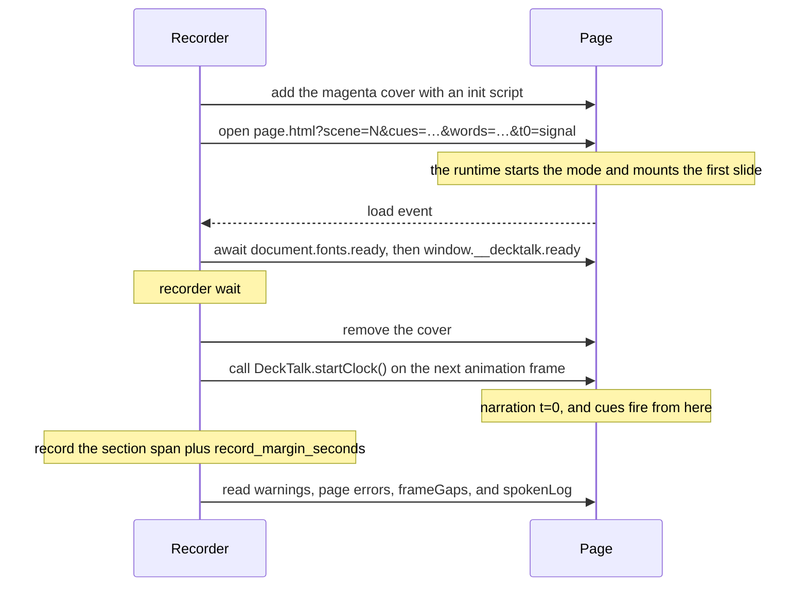

The page contract is the set of rules that lets the recorder play an HTML page in time with the
narration. To write a page, follow [Your first deck](/guides/first-deck).

1. `decktalk-runtime.js` implements the contract. A page can also [follow it by hand](/guides/page-by-hand).
2. A scene is markup: a `[data-scene]` wrapper holding one `<template data-slide>` per slide. Attributes do the work, and a page needs no JavaScript.
3. The URL of a page picks one of four modes.
4. The recorder hides the page under a magenta cover, then starts the page clock at narration t=0.
5. The first slide is already on the stage when the cover lifts. Every later slide mounts at the earliest cue it owns, and each cue fires at its cue time.
6. Your CSS styles the slides. The runtime adds only the stage element (`#dt-stage`), slide transitions, and reveal effects, and every rule of its own sits in `:where()`, so one rule of yours wins.

## Modes

A page holds scenes, and a page section plays one scene. A scene has slides, and each slide renders
one slide. A page plays in one of four modes, and `window.__decktalk.mode` holds the `mode` value.

| Mode | `mode` value | Opened as | What happens |
|---|---|---|---|
| Index mode | `index` | no query | The page lists every scene and slide, with play and freeze links. |
| Preview | `preview` | `?scene=N` | Each slide mounts in turn and stays for its `hold` seconds. A browser preview plays this mode. |
| Cue mode | `cue` | `?scene=N&cues=id@s,…` | Cue times drive the page. The recorder uses this mode. |
| Freeze mode | `freeze` | `?slide=ID`, optionally with `&after=CUE`, which `decktalk-probe.js` reads | One slide mounts with its reveals in their end state. `decktalk screenshots` and `decktalk preflight` use this mode. |

[Modes](/reference/runtime#modes) in the runtime reference lists the URL, the clock, and what
mounts in each mode.

### Browser preview and recording

A browser preview opens the page without `?cues=`, so it plays in preview. A recording plays in
cue mode. This table shows which values matter in each.

| Value | In a browser preview | In a recording |
|---|---|---|
| `hold` on a slide | The slide stays this many seconds, then the next slide mounts. | The recorder ignores it. A slide mounts at its earliest cue, and the last slide stays until the recording ends. |
| The `preview` object, or `data-preview` | Each cue fires this many seconds after the slide mounts. | Ignored. The cue times come from `build/cue-times.json`, and the object grants no ownership. |
| `data-delay` on an element | The element appears this many seconds after the slide mounts. | The same, for an element with no `data-cue`. |
| `data-cue` on an element | The element appears when the slide's preview timing fires its cue. | The element appears when its cue fires. |
| `data-text="spoken"` on an element | The element appears whole. | The words appear one at a time, from the `?words=` list. |

`data-cue` and `data-delay` are two triggers for one element, so an element that carries both warns
and the delay is ignored. A cued element with no preview timing stays hidden through a browser
preview, which is what a page whose whole timing lives in `cues.json` shows.

### Where a page is served from

`record`, `screenshots` and `preflight` open every page at `http://project.localhost/`, and answer
each request under that origin from your project directory. A page may therefore `fetch()` a file
beside it and load an ES module, neither of which works from a `file://` URL, and a relative URL
resolves exactly as it would from a file on disk. Nothing is downloaded and no port is opened.

To open a page in your own browser the same way, run `decktalk serve` and follow the URL it prints.

## The handshake



With `t0=signal` in the URL, the page starts its clock only when the recorder calls
`DeckTalk.startClock()`. A browser preview has no `t0=signal`, so its clock starts at the `load`
event.

The recorder wait comes after `window.__decktalk.ready` resolves and before the recorder removes the
cover. Two `[record]` settings set it.

```text
recorder wait = max(settle_seconds, min_cover_seconds - elapsed)
elapsed       = seconds since the recorder created its browser context
```

The defaults are `settle_seconds = 0.5` and `min_cover_seconds = 1.5`. The cover hides the page
during the wait. [How it works](/concepts/how-it-works#why-the-cuts-are-exact) explains why the
first frame after the cover is narration t=0.

From the first paint until the recording stops, the recorder keeps a 2 px square turning in the
bottom-right corner at 3 % opacity. The square keeps the browser drawing frames at the same pace
before and after t=0. A still page then records each reveal on its scheduled frame, not a frame or
two early. The square is too faint for `verify` or `record` to measure, and `decktalk screenshots` never
shows it. A page needs no motion of its own for timing.

A page that starts its own clock at `load` fires every cue early, by the whole time from `load` to
t=0. Every reveal in the video then comes before its word.

After the recording, the recorder reads these values from the page and writes them to the recording log:

- `window.__decktalk.warnings`. The recorder also logs each warning.
- The page's uncaught errors. A missing or empty `window.__decktalk.catalog` counts as one more error.
- `window.__decktalk.frameGaps`.
- `window.__decktalk.spokenLog`.

`record` reports `PAGE ERROR` for a page error, `KATEX ERROR` for a `data-tex` value KaTeX refused,
and `KATEX NOT LOADED` when the page asked for KaTeX and never got it. All three are certain, and
`verify` reports them again from the recording log. [decktalk record](/reference/cli#decktalk-record)
lists every verdict.

## Cue ownership

Each cue in `?cues=` has one owner, a slide of the playing scene. The runtime picks the owner with
three rules.

1. A slide whose id equals the cue id owns the cue.
2. A slide whose `owns` list names the cue owns the cue.
3. Otherwise, the slide whose id is the longest prefix of the cue id owns it. For example, slide `4.2` owns cue `4.2b1`, and slide `9` owns cue `9a`.

Rule 3 is the rule, and rules 1 and 2 are for the cue id that does not carry its slide's id. A
slide's preview timing grants no ownership, so seconds and ownership are never edited together by
accident. The runtime looks only in the playing scene.

In cue mode, ownership decides when each slide mounts:

- A slide mounts at the earliest cue time it owns.
- The first slide to mount is on the stage before the clock starts, whatever its earliest cue is, so no frame of the recording is drawn on an empty stage.
- A slide that owns no cue in `?cues=` never mounts.
- The last slide to mount stays until the recording ends.

A mismatch between `cues.json`, the page, and its slides adds a warning.
[Cue mismatches](/concepts/cues#cue-mismatches) lists each one, with its result.

## When a cue fires

When a cue fires, the runtime adds its id to `window.__decktalk.fired`. Then it does three things,
in this order:

1. Every element on the mounted slide whose `data-cue` matches the cue appears.
2. The mounted slide's `on[id]` handler runs, if the slide has one.
3. Every handler that `DeckTalk.on(id, fn)` registered for the cue runs, in the order of registration.

Each handler gets the slide element and a context object, `{ id, at, frozen, slideId }`. A handler
finds its elements with `slide.querySelector` and needs no global variable.
[Handler context](/reference/runtime#handler-context) describes the fields. An element with
`data-text="spoken"` starts to show its words one at a time when it appears.

## Build artifacts a page can read

A page gets its cue times as `?cues=`, from `build/cue-times.json`. It gets the section's spoken
words as `?words=`, and the words of the section before it as `?prevwords=`, both from
`build/narration/timeline.json`. A tool of your own can read those files too.
[Build artifacts](/reference/artifacts) has the shape of each file.

## Terms

| Term | Meaning |
|---|---|
| [page](/reference/glossary) | A page is an HTML file that page sections play, such as `deck/index.html`. |
| [scene](/reference/glossary) | A scene is one `[data-scene]` wrapper, or one `DeckTalk.scene(N, …)` call, in a page. A page section plays one scene. |
| [slide](/reference/glossary) | A slide is one `<template data-slide>` of a scene, or one entry in its `slides`, and the markup it mounts. |
| [mount](/reference/glossary) | A slide mounts when it enters the page. |
| [own](/reference/glossary) | A slide owns a cue by the three ownership rules. |
| [browser preview](/reference/glossary) | A browser preview is a page opened in a browser without `?cues=`. It plays in preview. |
| [cover](/reference/glossary) | The cover is the magenta overlay that hides the page until narration t=0. |
| [narration t=0](/reference/glossary) | Narration t=0 is the moment `DeckTalk.startClock()` runs, on the first frame after the cover. |
| [recorder wait](/reference/glossary) | The recorder wait is the time between `window.__decktalk.ready` and the removal of the cover. |
| [handler](/reference/glossary) | A handler is a function in a slide's `on` object, or one that `DeckTalk.on(id, fn)` registers. |

## Next

- **Write your first page:** [Your first deck](/guides/first-deck)
- **Size a slide and choose reveal effects:** [Design a slide](/guides/design-a-slide)
- **Look up every attribute and field:** [Runtime](/reference/runtime)
