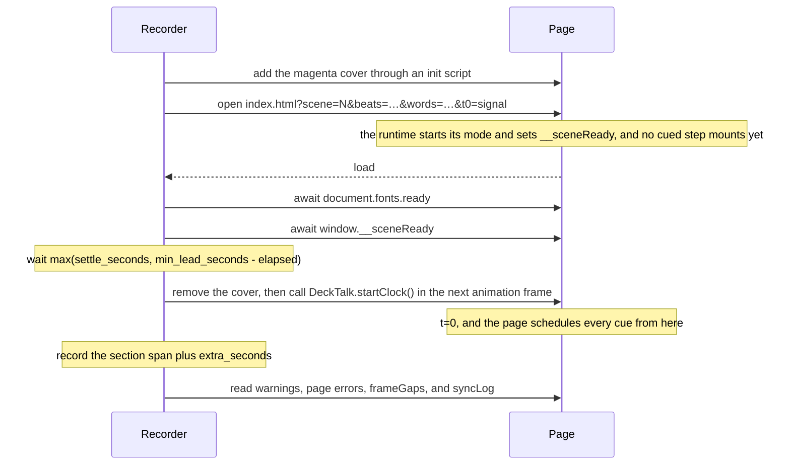

A DeckTalk page is an HTML file that the recorder can drive from the narration. The
contract consists of a few URL parameters, one Promise, and one global.
`decktalk-runtime.js` implements it, and [a page can implement it by hand](/guides/page-by-hand).
Slides are plain HTML that you style yourself, and the runtime adds no styling beyond
the stage. [The runtime reference](/reference/runtime) lists every parameter, field, and
attribute with its default.

## Modes

A page plays in one of four modes, and `window.__decktalk.mode` says which.

| Mode | Opened as | What happens |
|---|---|---|
| `index` | no query | The page lists every scene and step with play and freeze links. |
| `autoplay` | `?scene=N` | The steps mount in order, each holding for `hold` seconds divided by `speed`. Reveals fire at `data-at`, and a step's `cues` object fires handler cues at those seconds after the mount. This is the browser preview. |
| `cues` | `?scene=N&beats=id@s,…` | The resolved cues drive the page. Each step mounts at its earliest cue, the first cued step at t=0, and the last cued step holds until the recorder stops. A step with no cue never shows. This is the recording. |
| `frozen` | `?step=ID` or `?step=ID&cue=CUE` | The page shows one step with every reveal in its end state and its cues fired. With `cue`, only the step's cues up to and including that one fire, and an element that waits for a later cue stays hidden. `decktalk shots` uses it. |

In `cues` mode an element whose `data-cue` is in the list stays hidden until that cue
fires. Every other reveal fires `data-at` seconds after the mount, which covers an element
with `data-at` alone and an element whose cue is not in the list. When a cue fires, the
matching `data-cue` elements reveal first, then the step's `on[id]` handler runs, then
every `DeckTalk.on(id, fn)` handler. Each handler receives the slide element of the
mounted step and a context object `{ id, at, frozen, step }`, so it finds its elements
with `slide.querySelector` and needs no global.
[The runtime reference](/reference/runtime#handler-context) describes the fields. An
element with `data-sync` goes one step further and appears one word at a time from the
spoken words the recorder passes as `?words=`, so a line of text keeps pace with the
voice. The runtime gives it no container animation unless it sets `data-fx`.
[The runtime reference](/reference/runtime#data-attributes-inside-a-step) has its rules.

## The handshake

The recorder opens the page as `file:///…/deck/index.html?scene=N&beats=…&words=…&t0=signal`
plus any `params` from the section. `t0=signal` tells the page not to start its clock at
load. The recorder then waits for `load`, for `document.fonts.ready`, and for
`window.__sceneReady` when the page has one. Then it waits once, for `settle_seconds`, or
longer when fewer than `min_lead_seconds` have passed since the recorder was created, which is
`max(settle_seconds, min_lead_seconds - elapsed)`. Then it removes the magenta cover and
calls `DeckTalk.startClock()` in the next animation frame, and every cue is scheduled from
that instant. From the first paint until the recording stops, the recorder also keeps a
2 px, 3 % opacity square turning in the bottom-right corner. It keeps the compositor producing
frames at the same pace before and after t=0, so a page that goes still records each reveal on
its scheduled frame rather than a frame or two early, and it is too faint for `verify` or
`check` to see. A page needs no motion of its own for timing, and `decktalk shots` never shows
the square. Without `t0=signal`, the page starts its clock at `load` plus the `t0`
seconds given, which is what a browser preview does.

After the recording, the recorder reads `window.__decktalk.warnings` and logs every
string, and the `check` stage adds a `KATEX?` verdict when one of them says that KaTeX
never loaded or that a `data-tex` value could not be parsed. The recorder also reads the
page's uncaught errors, `window.__decktalk.frameGaps`, and `window.__decktalk.syncLog`, and
it writes all of them to the sidecar. [How it works](/concepts/how-it-works#why-the-cuts-are-exact) explains the
magenta cover that makes the first clean frame narration t=0.

<Warning>A page written by hand must start its clock only when `DeckTalk.startClock()`
is called. A page that starts at load fires every cue early by the settle time and the
recorder's lead, and every reveal in the video lands before its word.</Warning>

## Cue ownership

A cue belongs to exactly one step, and the step mounts at the earliest of its cues. The
runtime resolves the owner in this order.

1. The step with the same id as the cue.
2. The step whose `cues` list or object names the cue.
3. The step whose id is the longest prefix of the cue id. The cue `4.2b1` belongs to step `4.2`, and `9a` belongs to `9`.

A cue that no step owns is pushed onto `window.__decktalk.warnings` as an unknown cue id,
unless a `DeckTalk.on` handler is registered for it. When no listed cue has an owner,
nothing mounts and the page warns about that too. A step of the scene that owns no listed
cue never appears, and the page warns
`step "3.2" owns no cue in ?beats=, so it never appears`. An element whose `data-cue` is
not listed reveals at its `data-at` time after the mount, and the page warns about that as
well. The scaffold's `index.html` names every cue in its step's `cues` object. In autoplay that object
times the handlers, while a `data-cue` element still reveals at its `data-at` time, which
defaults to the mount, so the browser preview shows such an element before its cue fires.

Before anything is recorded, `decktalk beats` checks the other direction. Every cue id in
`cues.json` must appear in the page as a quoted literal, whether as `data-cue="ID"`, a
key of a step's `cues` object, or a key of an `on` handler. An id that the page never
mentions stops `build`, because no step could ever reveal it. A page that assembles its
ids from pieces at run time passes `--allow-unknown`, and the runtime warnings above are
then the only check.

## Designing the stage

The stage is 1920 by 1080 CSS pixels and scales to fit the window, so every size in the
page is a pixel size at that frame. These are the sizes the scaffold uses, and they read
well on a laptop screen and a phone alike.

| Element | Size |
|---|---|
| Safe margin | The safe margin is 96 px from every edge, and 160 px for titles. The scaffold sets 120 px side margins. |
| Body text | Body text is 36 px or larger. |
| Captions | Captions are 30 px, in the muted color. |
| Headlines | Headlines run from 64 px to 120 px. The scaffold's wordmark is 104 px and its end card tagline is 64 px. |
| Eyebrows and labels | Eyebrows and labels are 22 px, in the monospace face and the muted color. |

Put one idea on each slide. A slide that reveals more than three or four elements reads as an
animation, and a step with one headline and one supporting line gives each reveal a clearer
word to land on than a dense one does. Steps are cheap, so split a busy slide into two.

## Reveal effects

The `data-fx` attribute picks the animation an element plays when it appears. Each one
suits a kind of element, and each one has a case it makes worse.

| Effect | For | Against |
|---|---|---|
| `rise` (default) | It suits lines of text, labels, and cards. It moves up 10 px as it fades in over 0.3 s, which reads as a line arriving. | It does not suit code, tables, or anything aligned to a grid, where the motion looks like a layout shift. |
| `fade` | It suits code lines, chat bubbles, images, and anything that must not move. It fades in over 0.3 s. | It does not suit a single small element on a large slide, where a fade alone can be missed. |
| `draw` | It suits an SVG path with `pathLength="1"`. The stroke draws itself over `data-dur`. | It does not suit anything that is not a stroke. A filled shape does not draw. |
| `drop` | It suits a tile or a stamp that should land. It falls 24 px over 0.35 s. | It does not suit body text, where the fall is too heavy. |
| `pop` | It suits the answer, the number, or the one thing the section builds to. It overshoots to 108% and settles over 0.5 s. | It does not suit more than one element per slide, because two pops compete. |
| `dim` | It suits an element that should recede when a cue fires. It starts visible and fades to 16% over 1.2 s. | It does not suit an element that has not been on screen long enough to be noticed. |
| `none` | It suits an element that should appear on the frame of its cue with no animation, such as a cursor or a highlight. | It does not suit text, where a hard cut looks like a glitch. |

The animations are short on purpose, so that a reveal is visible on its word rather than
still arriving on the next one, and `data-dur` overrides any of them.

An element with `data-tex` is typeset by KaTeX when it appears, and the plain text inside
it is the fallback. A TeX string KaTeX cannot parse renders in red, and the runtime adds a
warning that names it. Inside a `render` template literal every backslash must be doubled, because `\f`, `\t`, `\u`, and `\x` are JavaScript escapes: `\frac` becomes a form feed, `\theta` a tab, and `\underbrace` or `\xrightarrow` a syntax error that blanks the page.

A scene may also set `camera: "push"`, a slow push from 100% to 103% over the scene.
Use it on at most one scene, usually the open, because a push under every scene reads as
the whole video breathing. The [control span](/concepts/how-it-works#the-control-span)
that `decktalk verify` measures accounts for the push, so the push does not disturb the
cue checks.

## Build artifacts a page or a tool of your own may read

The page receives its cues as `?beats=` from `build/audio/beats.json`, and a tool of
your own may read `build/audio/timeline.json` for every word with its absolute time.
[Build artifacts](/reference/artifacts) has every shape.
